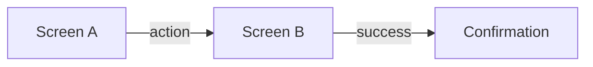

# UI Specification (UI-SPEC)

**Status:** [Draft / In Review / Finalized]
**Version:** v1.0
**Owner:** [Your Name]
**Source Brief:** `DESIGN-BRIEF.md`
**Design Guideline:** [path / name of the guideline these values resolve to, or "interviewed" / "defaults from foundations"]
**Stakeholders:** [Design, Product, Engineering]

> UI design — layout, hierarchy, states, interactions, and the visual details that matter for this feature. Where a value is committed, it traces to a design token (or is flagged `assumed` / `TBD`). Capture what matters; don't pad every element with every dimension. Name every element and label using `.sdd/UL-MAP.md`.
>
> **Acceptance criteria are NOT here.** They live in `DESIGN-BRIEF.md` as scenarios. This spec contains **no scenarios and no Given/When/Then** — see §5 for the pointer. Building the design (real screens/prototypes) is `design-build`.

---

## 1. Overview & Goal

- **Goal:** <the user need this experience serves — from the brief>
- **Experience Goals:** <the qualities to uphold — from the brief>
- **Out of Scope:** <what these screens do NOT cover>

---

## 2. Design Tokens (the ones this feature uses)

The resolved values the elements below reference — include only what this feature actually uses; no need to transcribe the whole guideline. Source: <guideline path / interviewed / foundations defaults>. Flag every `assumed` (proposed, not in the guideline) and `TBD` value.

| Group | Token | Value | Source |
| :--- | :--- | :--- | :--- |
| color | `brand.primary` | `#…` | guideline |
| color | `text.primary` | `#…` | guideline |
| color | `status.danger` | `#…` | assumed |
| typography | `font.family` | `…` | guideline |
| typography | `size.body` / `weight.regular` | `16px` / `400` | guideline |
| space | `space.md` | `16px` | guideline |
| radius | `radius.md` | `8px` | guideline |
| elevation | `elevation.card` | `0 1px 3px rgba(0,0,0,.12)` | assumed |

---

## 3. Screen Inventory & Navigation

| Screen | Purpose | Entry Point(s) | Exits / Next |
| :--- | :--- | :--- | :--- |
| <Screen A> | <what it lets the user do> | <how the user arrives> | <where they go next> |

**Flow map** (optional Mermaid):


---

## 4. Per-Screen Spec

Repeat this block for each screen.

### Screen: <Name>

**Regions & reading order:** <e.g. Header → Content (list) → Action bar>

**ASCII wireframe** (relative position — not to scale):
```
+------------------------------------------+
| [< Back]            Title            [⋯] |  <- header
+------------------------------------------+
|  Search input........................    |
|                                          |
|  [ Item card ]                           |  <- content list
|  [ Item card ]                           |
|                                          |
+------------------------------------------+
|                 [ Primary action ]       |  <- action bar (bottom-right)
+------------------------------------------+
```

**Elements — structure:**

| Element (UL-MAP name) | Type | Region / Position | Priority | Behavior |
| :--- | :--- | :--- | :--- | :--- |
| <e.g. 送出按鈕> | Button | Action bar, bottom-right | Primary | <what it does on activate> |
| <e.g. 搜尋框> | Input | Top of content | — | <what it filters> |

**Elements — visual details (only what matters):** fill in the columns that are meaningful for this feature and leave the rest blank — don't force a value into every cell. Add a row only for the elements/states whose look you actually decided; where you commit a value, trace it to a §2 token or flag it `assumed` / `TBD`. Columns are a menu, not a mandatory set.

| Element | State | Fill | Text / Icon | Border | Radius | Size | Font | Padding | Elevation |
| :--- | :--- | :--- | :--- | :--- | :--- | :--- | :--- | :--- | :--- |
| 送出按鈕 | default | `brand.primary` | `text.onBrand` | — | `radius.md` | — | weight 600 (emphasis) | — | — |
| 送出按鈕 | disabled | `#… (assumed)` | | — | | | | | |
| 搜尋框 | error | | | `status.danger` | | | | | |

**States (what changes on screen):**

| State | What the user sees | Visual deltas (which element values change) |
| :--- | :--- | :--- |
| Default | <…> | — |
| Empty | <…> | <…> |
| Loading | <…> | <…> |
| Error | <…> | <e.g. 搜尋框 border → `status.danger` `#…`> |
| Success | <…> | <…> |
| Restricted / no permission | <…> | <…> |

---

## 5. Acceptance Criteria (pointer — not restated here)

The acceptance criteria for this feature are the **Scenarios (Specification by Example)** in `DESIGN-BRIEF.md`. They are **not** restated here — no scenarios or Given/When/Then live in this spec.

Coverage confirmation — every brief scenario's states and interactions have a home in the screens above:

| Brief scenario (ref) | Screen(s) / state(s) that realize it |
| :--- | :--- |
| <Flow / rule — row #> | <Screen · state> |

---

## 6. Interactions & Transitions

- **<Element → action>:** <feedback, what appears/disappears, navigation, transition (duration/easing from tokens where defined)>
- **Navigation:** <back behavior, deep links, guard conditions>
- **Motion:** <purpose + concrete timing/easing where the guideline defines it; otherwise `assumed` / `TBD`>

---

## 7. Content & Copy

| Location | Text | Notes (tone, length limit) |
| :--- | :--- | :--- |
| <e.g. 空狀態> | <"還沒有訂單,去逛逛吧"> | <UL-MAP aligned> |

---

## 8. Accessibility & Responsive

- **Focus / keyboard / touch order:** <…>
- **Small screen (reflow):** <how regions rearrange; which token values change at breakpoints>
- **Large screen:** <…>
- **Accessibility target:** <e.g. WCAG AA — state the contrast ratios the chosen color pairs meet>

---

## 9. Open Items

- <any value still `TBD` and why — e.g. "danger color awaiting brand sign-off">
- <assumed values the user should confirm or override>

---

## 10. Dependencies & Risks

- **Dependencies:** <shared components, other flows, content sources, the design guideline version>
- **Risks:** <unresolved layout/interaction/visual questions, feasibility concerns>
